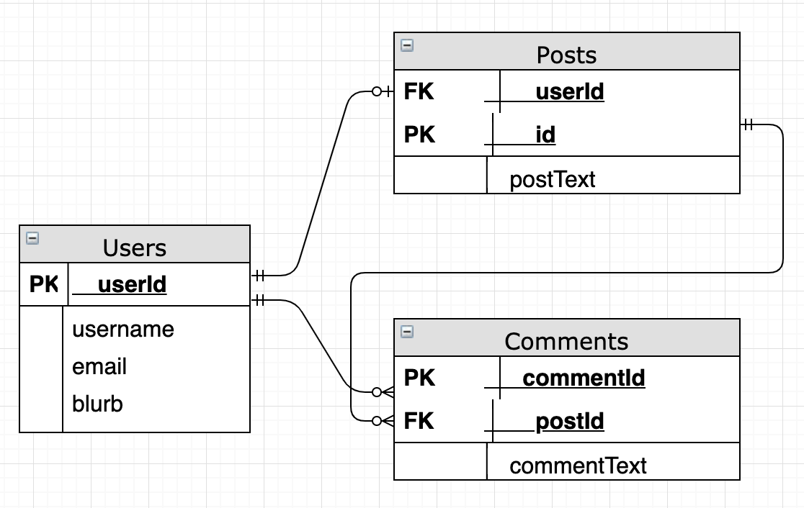

# Server Side Architecture

**NOTE: This tutorial assumes you already have a GCP instance with mysql started and connected with MySQLWorkbench**

## Application Idea

- My app will have Users

- Users will be able to:
    - Sign Up
    - Sign In
    - Read their content
    - Create their content
    - Update/Edit their content
    - Delete their content

- Users will have a Profile
    - Username
    - Email
    - About me blurb

- My app will have Posts
    - Users can CRUD posts

- My Posts will have Comments
    - Users can Create, Read and Delete Comments

## Tables

- This is a solid site to find examples of tables: https://sample-videos.com/download-sample-sql.php

1.  Users

2. Posts

3. Comments



**Be sure to save an image of your diagram to put in your project repository later**

## Create MySQL Tables

0. Create your tables using SQL

    - Check out [This file](sql/initialize.sql) or [This file](https://github.com/AustinCodingAcademy/311_wk3_day2_advanced_select/blob/master/initialize.sql) for syntax.

1. Open MySQL Workbench - admin DB which is connected to GCP

2. Create a new schema - enter your app name as the schema name
    - Make sure your schema is highlighted (bolded) before the next step

3. Copy and paste your `.sql` code (example below) and execute

4. Refresh your new schema to see your newly created tables

```sql
DROP TABLE IF EXISTS users;

CREATE TABLE users (
  id INT NOT NULL AUTO_INCREMENT,
  username VARCHAR(50),
  email VARCHAR(50),
  blurb VARCHAR(255),
  PRIMARY KEY (id)
);

CREATE TABLE posts (
  post_id INT NOT NULL AUTO_INCREMENT,
  user_id INT NOT NULL,
  post_text VARCHAR(255),
  PRIMARY KEY (post_id),
  FOREIGN KEY (user_id)
  REFERENCES users (id)
);

CREATE TABLE comments (
  comment_id INT NOT NULL AUTO_INCREMENT,
  post_id INT NOT NULL,
  comment_text VARCHAR(255),
  PRIMARY KEY (comment_id),
  FOREIGN KEY (post_id)
  REFERENCES posts (post_id)
);
```

## Create your projects GitHub Repo

0. Go to www.github.com/yourUsername

1. Click the `+` button in the upper right hand menu and click New Repository

2. Name your repo, create it, and `git clone` the HTTPS link.

3. Create a `sql` folder and add your `initialize.sql` file.
    - Don't forget to `git add .` and `git push`

## Creating a Node Express Server

- Use [this repo](https://github.com/eamoses/311/tree/master/311_wk2_day2_express-continued) to remind yourself of the construction of an express app.

0. In your projects repository do `npm init` to create a `package.json`

1. Add a `.gititnore` and add `node_modules` to it. Add and commit this file.

2. Make sure to add the following dependencies: `npm install --save express body-parser` and `npm install -g --save nodemon` and add `"start": "nodemon ./index.js"` to your `package.json`

3. Add an `index.js` file and include generally the following:

```javascript
const express = require('express')
const app = express()
const users = require('./routers/users')
const port = process.env.PORT || 4001
const bodyParser = require('body-parser')

app.use(bodyParser.urlencoded({ extended: false }))
app.use(bodyParser.json())
app.use(users)

app.listen(port, () =>
  console.log(`Example app listening on port ${port}!`))
```

4. Add a `routers` folder and add your first table, mine is users `users.js`

Your first table's javascript file should look something like this:

```javascript
const express = require('express');
const router = express.Router();
const usersController = require('../controllers/users');

router.get('/', usersController.getUsers)

module.exports = router;
```

5. Create a `controllers` folder and name the javascript file within it the same as the previous javascript file. Mine was users.

```javascript
const mysql = require('mysql')
const pool = require('../mysql/connection')
const { handleSQLError } = require('../mysql/error')

// Select all fields from the users table.
// limit the results to 50.
// Use res.json to return the results to the user.
const getUsers = (req, res) => {
    pool.query("SELECT * FROM users", (err, rows) => {
      if (err) return handleSQLError(res, err)
      return res.json(rows);
    })
}

module.exports = {
    getUsers
}
```

6. Create a `mysql` folder and [make the contents look like this](https://github.com/eamoses/311/tree/master/311_wk5_both_api_hackathon/mysql) and do `npm install --save mysql`

    - This is where we enter our unique SQL db info. In order to hide our passwords, do the following:

    1. Add `config.js` to your `.gitignore` file, add and commit this.

    2. Create a `config.js` file at the root level of your app and add `const password = "whatever your password is"; module.exports = password;`

    3. In your `mysql/connection.js` file add `const password = require('../config')` at the top. Use your `password` variable in the password connection portion of your `pool`
    
    4. Change your `controllers/whatever.js` file to look more [like this file](https://github.com/eamoses/311/blob/master/311_wk5_both_api_hackathon/controllers/employees.js)
    
    5. Open Postman and start CRUD'n your app!

**Don't forget to place your ER Diagram as an image into an `images` folder on the root level of your project repo**

TA DA! You have created a diagram, a schema from scratch, and connected it with a Nodejs Express server!
